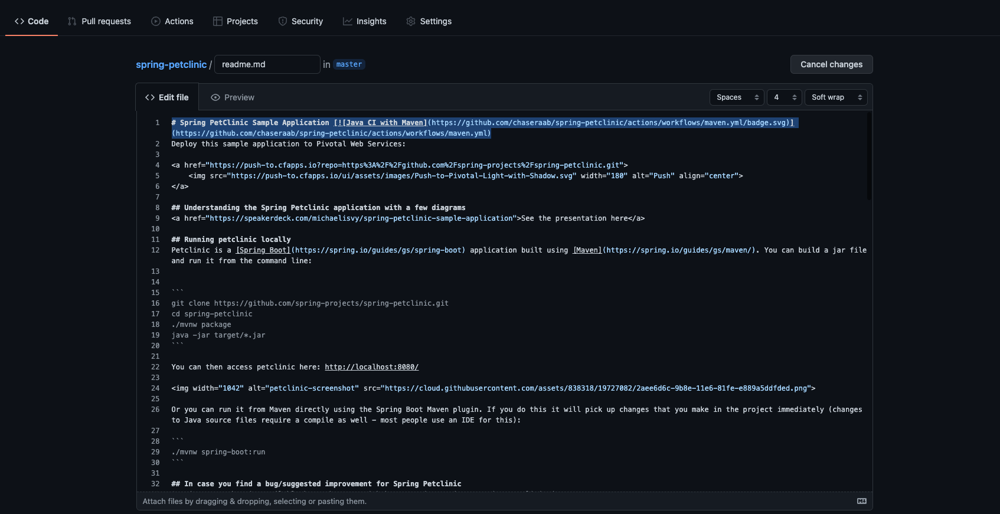
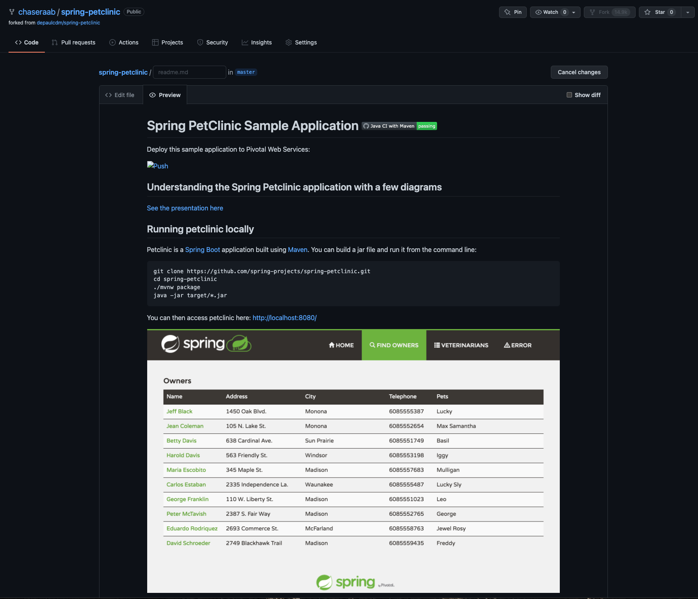
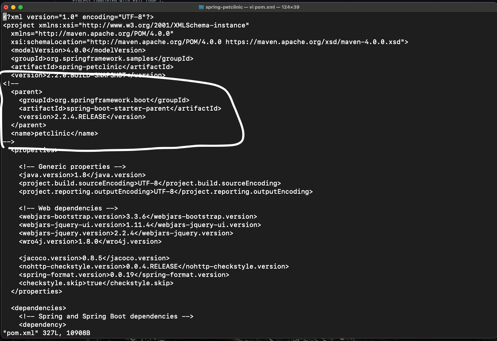
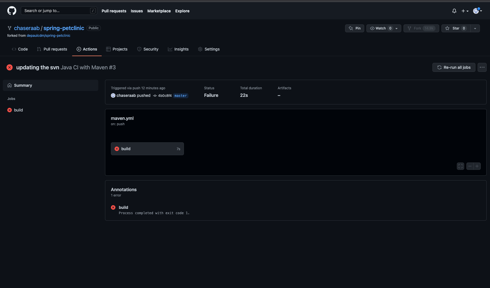
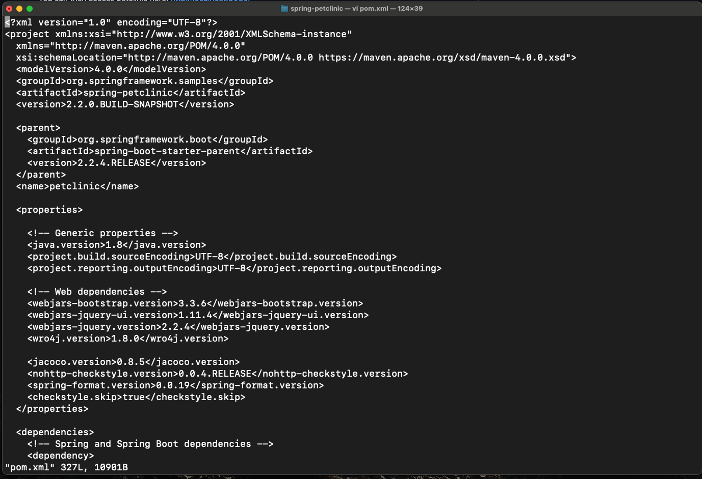
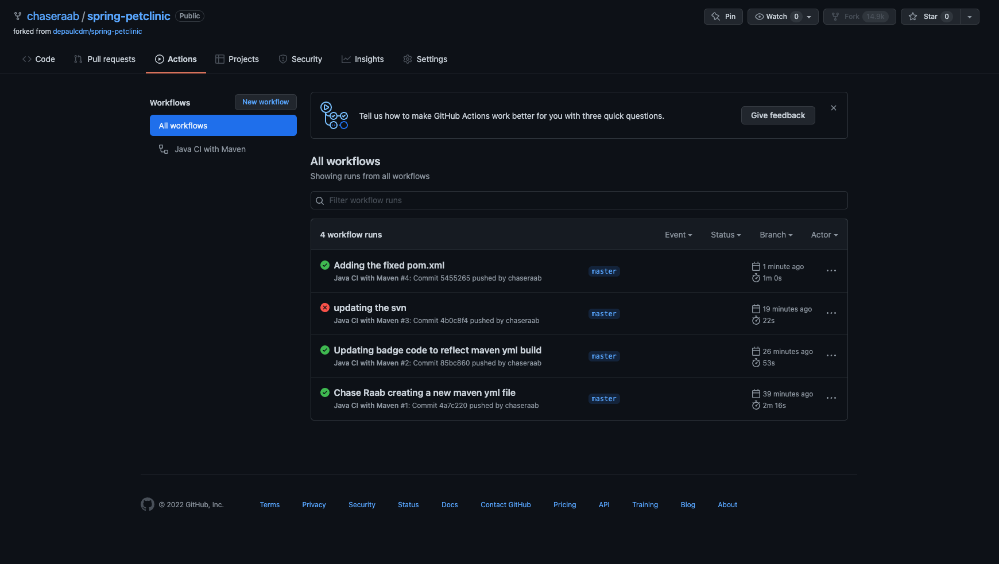

My Successful Build

My Badge Code

My Badge Status

pom.xml with coordinates commented out

Failed build

Badge failure in readme.md

Fixed pom.xml

Actions Page - Succesful Build

Badge success in readme.md
